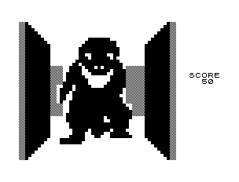

# MazeRunner

## Maze Runner with MQTT
This project is for educational purpose. MQTT stands for Message Queuing Telemetry Transport. It is a lightweight publish and subscribe system where you can publish and receive messages as a client. 


## Maze
```bash
├── docker
│   ├── Dockerfile      A script to create a image to build and run c++ and java applications
│   └── Makefile        Definition how to build the image or other applications, used by make-tool 
├── Framework           
│   ├── Control         Gui application to call other applications
│   ├── DotMatrix       Used for the IoT Demonstration 
│   ├── Generator       Maze generator application
│   ├── Interface       Interface definitions of the mazerunner project
│   ├── MQTTBroker      MQTT tools and broker for windows from Mosquitto project
│   ├── README.md
│   ├── Test            Tests for the mazerunner project
│   └── Visualizer      Gui application to visualize the Maze for Generator and for solver
├── install.bat
├── jenkins             Used for CI Demonstration
├── Jenkinsfile         Build and deployment pipeline for Mazerunner in Jenkins
├── README.md
├── requirements.txt    Python module dependencies of Mazerunner used with "pip install -r requirements.txt."
└── Teams
    ├── README.md
    ├── ReferenceSolutionAStar 
    ├── ReferenceSolutionBreadthFirst
    ├── TeamB
    ├── TeamC
    ├── TeamD
    ├── TeamE
    └── TeamTemplate
```