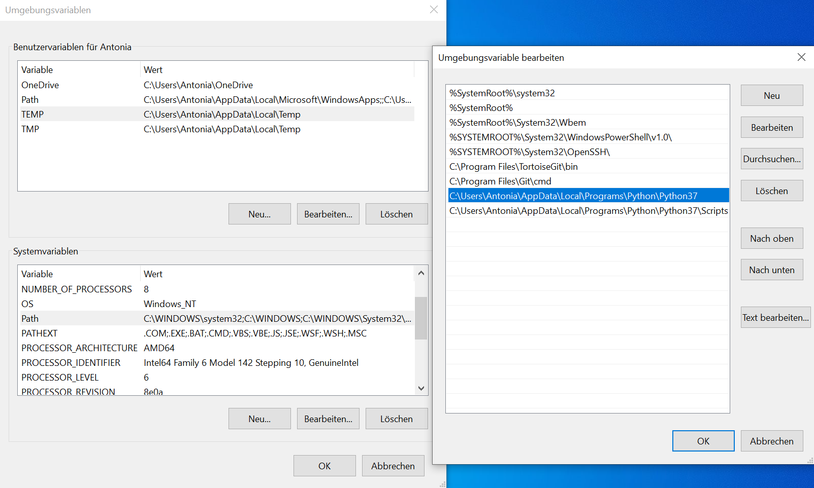
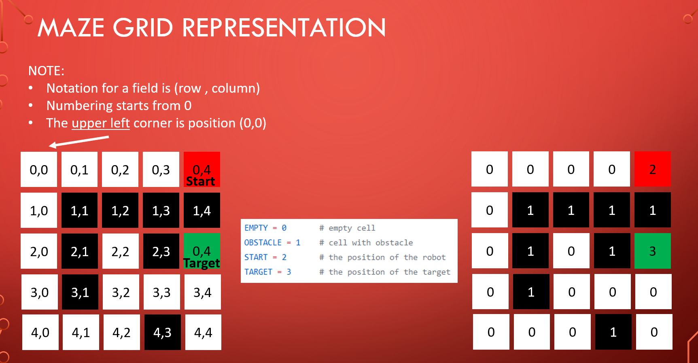
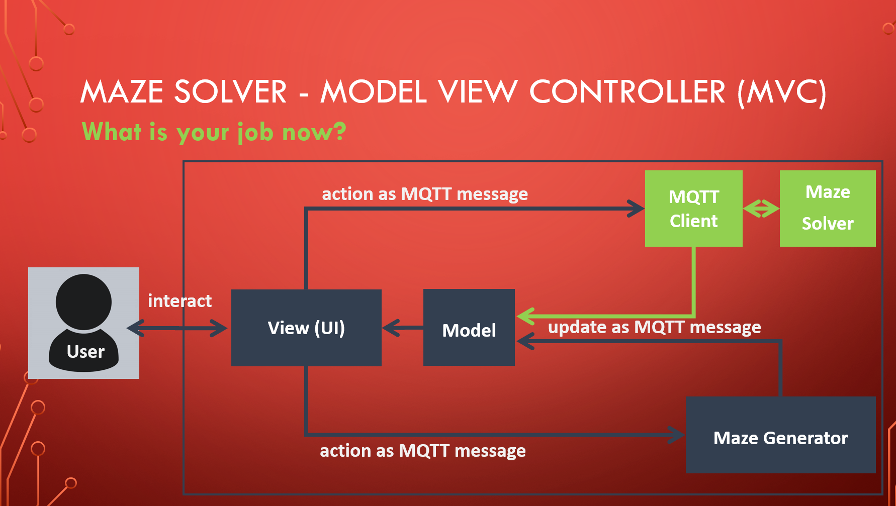
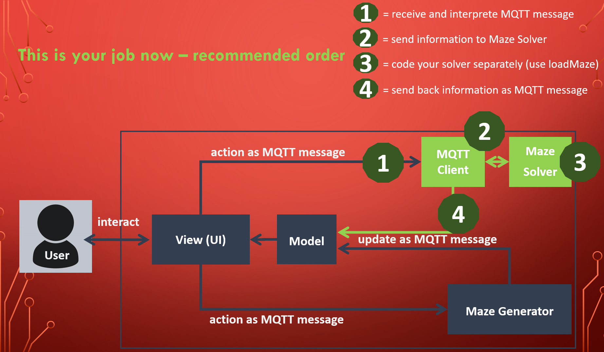
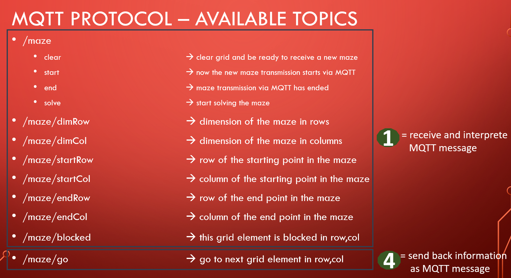

# MazeRunner Project 


## 1. Maze Runner in Python with MQTT
This project is created by Susanna Hepp and Antonia Reiter for educational purpose. Mazerunner is a collection of applications to introduce Service orientation, IoT technologies and collaborative development using state of the art DevOps systems like Github. 

**DevOps** is a set of software development practices that combine software development (Dev) and information technology operations (Ops) to shorten the systems development life cycle while delivering features, fixes, and updates frequently in close alignment with business objectives.

**MQTT** stands for Message Queuing Telemetry Transport. It is a lightweight publish and subscribe system where you can publish and receive messages as a client. For almost every language and devices, libraries are available to implement Publisher and Subscriber communicating in heterogenes networks e.g. https://www.mysensors.org/build/mqtt_gateway


## 2. Install for Windows 10
1. Python3.7
download and install the latest Installer for 3.7.x Version from https://www.python.org/ftp/python/
e.g. https://www.python.org/ftp/python/3.7.6/python-3.7.6-amd64.exe

2. Git-Client
download and install the git client for windows from https://git-scm.com/download/win
e.g. https://github.com/git-for-windows/git/releases/download/v2.24.1.windows.2/Git-2.24.1.2-64-bit.exe

3. Create a project folder locally on your system, e.g. c:\myprojects 

4. Open Commandline via ```<win>+r cmd```

5. Change directory into cloned directory, e.g. ```cd c:\myprojects```

6. clone this repository ```git clone https://github.com/AntoniaSophia/MazeRunner.git```


7. Change directory into cloned directory, e.g. ```cd MazeRunner```
   <br/>You are now in a directory like ```c:\myprojects\MazeRunner``` - we call this directory further on ```<project_root>```

8. Ensure to set the system path environment variable ```%PATH%``` correctly with Python37 and Python37/scripts directory



9. Update pip ```pip install --upgrade pip```

10. Install required python packages: ```pip install -U -r requirements.txt```

### Congratulations - now your are ready to go.... 

## 3. Visual Studio Code 
### Visual Studio Code Installation
1. Download and install Visual Studio Code from https://code.visualstudio.com/Download#
2. Install Python Extension: https://marketplace.visualstudio.com/items?itemName=ms-python.python
3. Install Robot Testframework extension https://marketplace.visualstudio.com/items?temName=vivainio.robotframework

### Visual Studio Code Configuration
#TODO
- plugins
- pylint

## 4. Better UI for Git 
Use one of both tools
- GitKraken - download at https://www.gitkraken.com/download
- TortoiseGit - download at https://tortoisegit.org/

## 5. Execute Unit Tests
In order to execute all available UnitTests: 
```
cd <project_root> 
pytest -v
```

Expected output would be something like 


Alternatively you could also execute a UnitTest from a Team locally, this time we also use Code Coverage
```
cd <project_root>/Teams/ReferenceSolutionAStar
robot run_unit_test.robot 
```

Expected output would be something like 

## 6. Execute coding style checker flake8
In order to execute the coding style checker flake8:
```
cd <project_root>
flake8
```
Expected output would be <empty> as the original project is cleaned against coding style violations.

## 7. Execute Robotframework Tests
```
cd <project_root>/robotframework
robot end2end_astar.robot
```

## 8. Pytest
#TODO: Further explanation tbd 

## 9. Pylint
#TODO: Further explanation tbd 

## 10. Robot Testframework
#TODO: Further explanation tbd 


## 11. GitHub pipeline .github
#TODO
- Docker
- Codecov

## 12. Maze Application 
```
├── .github           
│   ├── workflows       Stores the Github pipeline file pythonapp.yml 
├── Framework           
│   ├── DotMatrix       Used for the IoT Demonstration 
│   ├── Generator       Maze generator application
│   ├── Interface       Interface definitions of the mazerunner project
│   ├── MQTTBroker      MQTT tools and broker for windows from Mosquitto project
│   ├── README.md
│   ├── Test            Tests for the mazerunner project
│   └── Visualizer      Gui application to visualize the Maze for Generator and for solver
├── .coveragerc         The configuration of the code coverage tool Coverage.py - see https://coverage.readthedocs.io/en/coverage-5.0/
├── .flake8             The configuration of the coding style checker tool flake8 - see http://flake8.pycqa.org/en/latest/ 
├── .gitignore          The configuration for git - all files to be ignored for change managment
├── .pylintrc           The configuration of the coding style checker tool Pylint - see https://www.pylint.org/ 
├── README.md           The README file of the whole project (= this page)
├── requirements.txt    Python module dependencies of Mazerunner used with "pip install -r requirements.txt."
└── Teams
    ├── README.md
    ├── ReferenceSolutionAStar              Reference Solution for an A* Algorithm
    ├── ReferenceSolutionBreadthFirst       Reference Solution for an BreadthFirst Algorithm
    ├── TeamA                               Empty folder for TeamA to implement their solution
    ├── TeamB                               Empty folder for TeamB to implement their solution
    ├── TeamC                               Empty folder for TeamC to implement their solution
    ├── TeamD                               Empty folder for TeamD to implement their solution
    ├── TeamE                               Empty folder for TeamE to implement their solution
    └── TeamTemplate                        Folder containing the starting templates for implementation the solution
                                            Use this folder as copy&paste for starting point of an Python-based solution
```


## 13. And now let your job begin.... 
### How is the Maze described?
- a maze is defined as a grid of dimension n,m - in our case we use a square as grid, which means n=m.
- blocked fields are marked as integer 1
- free fields are marked as integer 0
- starting position (=start of maze) is marked as integer 2
- target position (= exit of maze) is marked as integer 3

<b>NOTE:</b>
- Notation for a field is (row , column) - that means row is always before column
- The integer numbering starts from 0, which means in a maze with dimension 5 we have rows from 0..4 and columns from 0..4
- The upper left corner is the position (0,0) (be aware this might not be intuitive!)

 

 

### How is the overall project architecture?
 

 


### How are the MQTT messages being defined?
In general MQTT messages are being defined with a topic and a payload, e.g. ```/topic payload```

Examples
- ```/maze clear```     --> Topic: /maze		Payload: clear  (Interpretation: clear the complete maze)
- ```/maze/dimRow 5```	--> Topic: /maze/dimRow	Payload: 5      (Interpretation: specify the number of rows of the maze)
- ```/maze/go 1,5```    --> Topic: /maze/go     Payload: 1,5    (Move the robot to next field 1,5 - 1=row, 5=col)

See the list of all MQTT messages and their interpretation:
 

One valid sequence of a newly created maze could look like this:
```
/maze clear
/maze start
/maze/dimCol 5
/maze/dimRow 5
/maze/startCol 4
/maze/startRow 0
/maze/endCol 4
/maze/endRow 2
/maze/blocked 1,1
/maze/blocked 1,2
/maze/blocked 1,3
/maze/blocked 1,4
/maze/blocked 2,1
/maze/blocked 2,3
/maze/blocked 3,1
/maze/blocked 4,3
/maze end
```

In order to receive new messages you have to implement and register the following callback function ```def on_message(self, master, obj, msg)```, e.g. ``` 
def onMessage(self, master, obj, msg):
     topic = str(msg.topic)
     payload = str(msg.payload.decode("utf-8"))
     print("Received message: ", topic, " --> ", payload)
     # now start your business logic
``` 

In order to register for receiving any MQTT messages you have to implement the following callback function ```def on_connect(self, master, obj, flags, rc)```, e.g. ```
def onConnect(self, master, obj, flags, rc):
    self.master.subscribe("/maze")
    self.master.subscribe("/maze/dimRow")
    self.master.subscribe("/maze/dimCol")
    self.master.subscribe("/maze/startCol")
    self.master.subscribe("/maze/startRow")
    self.master.subscribe("/maze/endCol")
    self.master.subscribe("/maze/endRow")
    self.master.subscribe("/maze/blocked")
``` 

And finally this is how you get everything started:
´´´
MQTT_CLIENT = mqtt.Client()
MQTT_CLIENT.on_connect = onConnect
MQTT_CLIENT.on_message = self.onMessage
MQTT_CLIENT.master.connect(MQTT_SERVER, 1883, 60)
´´´