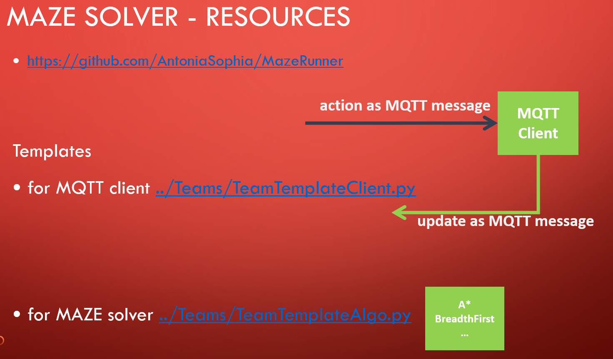

# MazeRunner Project 
This project is created in 2019 by Susanna Hepp and Antonia Reiter for educational purpose. 


## 1. Maze Runner in Python with MQTT
Mazerunner is a collection of applications to introduce Service orientation, IoT technologies and collaborative development using state of the art DevOps systems like Github. 

**DevOps** is a set of software development practices that combine software development (Dev) and information technology operations (Ops) to shorten the systems development life cycle while delivering features, fixes, and updates frequently in close alignment with business objectives.

**MQTT** stands for Message Queuing Telemetry Transport. It is a lightweight publish and subscribe system where you can publish and receive messages as a client. For almost every language and devices, libraries are available to implement Publisher and Subscriber communicating in heterogenes networks e.g. https://www.mysensors.org/build/mqtt_gateway


## 2. Install for Windows 10
1. Python3.7
download and install the latest Installer for 3.7.x Version from https://www.python.org/ftp/python/
e.g. https://www.python.org/ftp/python/3.7.6/python-3.7.6-amd64.exe

2. Git-Client
download and install the git client for windows from https://git-scm.com/download/win
e.g. https://github.com/git-for-windows/git/releases/download/v2.24.1.windows.2/Git-2.24.1.2-64-bit.exe

3. Create a project folder locally on your system, e.g. c:\myprojects 

4. Open Commandline via ```<win>+r cmd```

5. Change directory into cloned directory, e.g. ```cd c:\myprojects```

6. clone this repository ```git clone https://github.com/AntoniaSophia/MazeRunner.git```


7. Change directory into cloned directory, e.g. ```cd MazeRunner```
   <br/>You are now in a directory like ```c:\myprojects\MazeRunner``` - we call this directory further on ```<project_root>```

8. Ensure to set the system path environment variable ```%PATH%``` correctly with Python37 and Python37/scripts directory


9. Update pip ```pip install --upgrade pip```

10. Install required python packages: ```pip install -U -r requirements.txt```

### Congratulations - now your are ready to go.... 

## 3. Visual Studio Code 
### Visual Studio Code Installation
1. Download and install Visual Studio Code from https://code.visualstudio.com/Download#
2. Install Python Extension: https://marketplace.visualstudio.com/items?itemName=ms-python.python
3. Install Robot Testframework extension https://marketplace.visualstudio.com/items?temName=vivainio.robotframework

### Visual Studio Code Configuration
#TODO
- plugins
- pylint

## 4. Better UI for Git 
Use one of both tools
- GitKraken - download at https://www.gitkraken.com/download
- TortoiseGit - download at https://tortoisegit.org/

## 5. Execute Unit Tests
In order to execute all available UnitTests: 
```
cd <project_root> 
pytest -v
```

Expected output would be something like 


Alternatively you could also execute a UnitTest from a Team locally, this time we also use Code Coverage
```
cd <project_root>/Teams/ReferenceSolutionAStar
robot run_unit_test.robot 
```

Expected output would be something like 

## 6. Execute coding style checker flake8
In order to execute the coding style checker flake8:
```
cd <project_root>
flake8
```
Expected output would be <empty> as the original project is cleaned against coding style violations.

## 7. Execute Robotframework Tests
```
cd <project_root>/robotframework
robot end2end_astar.robot
```

## 8. Pytest
#TODO: Further explanation tbd 

## 9. Pylint
#TODO: Further explanation tbd 

## 10. Robot Testframework
#TODO: Further explanation tbd 


## 11. GitHub pipeline .github
#TODO
- Docker
- Codecov

## 12. Maze Application 
```
├── .github           
│   ├── workflows       Stores the Github pipeline file pythonapp.yml 
├── Framework           
│   ├── DotMatrix       Used for the IoT Demonstration 
│   ├── Generator       Maze generator application
│   ├── Interface       Interface definitions of the mazerunner project
│   ├── MQTTBroker      MQTT tools and broker for windows from Mosquitto project
│   ├── README.md
│   ├── Test            Tests for the mazerunner project
│   └── Visualizer      Gui application to visualize the Maze for Generator and for solver
├── MazeExample         A few hardcoded maze examples which are being used to get reproducable results for e.g. Unit Testing   
├── .coveragerc         The configuration of the code coverage tool Coverage.py - see https://coverage.readthedocs.io/en/coverage-5.0/
├── .flake8             The configuration of the coding style checker tool flake8 - see http://flake8.pycqa.org/en/latest/ 
├── .gitignore          The configuration for git - all files to be ignored for change managment
├── .pylintrc           The configuration of the coding style checker tool Pylint - see https://www.pylint.org/ 
├── README.md           The README file of the whole project (= this page)
├── requirements.txt    Python module dependencies of Mazerunner used with "pip install -r requirements.txt."
└── Teams
    ├── README.md
    ├── ReferenceSolutionAStar              Reference Solution for an A* Algorithm
    ├── ReferenceSolutionBreadthFirst       Reference Solution for an BreadthFirst Algorithm
    ├── TeamA                               Empty folder for TeamA to implement their solution
    ├── TeamB                               Empty folder for TeamB to implement their solution
    ├── TeamC                               Empty folder for TeamC to implement their solution
    ├── TeamD                               Empty folder for TeamD to implement their solution
    ├── TeamE                               Empty folder for TeamE to implement their solution
    └── TeamTemplate                        Folder containing the starting templates for implementation the solution
                                            Use this folder as copy&paste for starting point of an Python-based solution
```


## 13. And now let your job begin.... 
### How is the Maze described?
A maze is a structured map containing different location elements which are connected to each other and represent an environment in which objects can navigate. There are plenty types of structures possible: squares, honeycombs, graphs,...
See also [A* Star Tutorial](docs/slides/A_Star_Tutorial.pdf) which provides a great introduction to map representation.
In order to read more about maze representation you my also check the following ressources
- https://www.redblobgames.com/pathfinding/a-star/introduction.html
- http://theory.stanford.edu/~amitp/GameProgramming/MapRepresentations.html
- http://theory.stanford.edu/~amitp/GameProgramming/MapRepresentations.html 
- https://en.wikipedia.org/wiki/Admissible_heuristic  
- http://theory.stanford.edu/~amitp/GameProgramming/


<b>Let's get back to our project.....how is a maze in our case defined?</b>
- our maze is defined as a grid of dimension (n,n) - which means we use a square as grid
- blocked fields are marked as integer 1
- free fields are marked as integer 0
- starting position (=start of maze) is marked as integer 2
- target position (= exit of maze) is marked as integer 3

<b>NOTE:</b>
- Notation for a field is (row , column) - that means row is always before column
- The integer numbering starts from 0, which means in a maze with dimension 5 we have rows from 0..4 and columns from 0..4
- The upper left corner is the position (0,0) (be aware this might not be intuitive!)

 

### Maze solving algorithms
There are many maze solving algorithms out there, in our case we concentrate on the following algorithms:
- BreadthFirst
- A* 
- Dijkstra
  
We closely follow the implementation of "Red Blob Games" See also [A* Tutorial](docs/slides/A_Star_Tutorial.pdf) (here is the original link [Red Blob Games](https://www.redblobgames.com/pathfinding/a-star/introduction.html)) which provides a great introduction to different types of maze solving algorithms. As the description there is so great we don't dare to come up with a different description which could only be much worse...

Please refer to the reference implementations in the following files:
- [BreadthFirst reference implementation](../MazeRunner/Teams/ReferenceSolutionAStar/MazeSolverAlgoAStar.py)
- [A* reference implementation](../MazeRunner/Teams/ReferenceSolutionBreadthFirst/MazeSolverAlgoBreadthFirst.py)

See following code which is taken from the A* reference implementation
```
   def aStar(self):
        result_path = []
        print("[MazeSolverAlgoAStar]: Start of A* Solver...")

        #############################
        # Here A* starts
        #############################
        start = [self.startRow, self.startCol]
        frontier = queue.PriorityQueue()
        frontier.put((0, start))

        startKey = self.gridElementToString(self.startRow, self.startCol)
        came_from = {}
        came_from[startKey] = None

        cost_so_far = {}
        cost_so_far[startKey] = 0

        goal = [self.endRow, self.endCol]

        while not frontier.empty():
            current = frontier.get()[1]
            currentKey = self.gridElementToString(current[0], current[1])

            if self.isSameGridElement(current, goal):
                break

            for next_neighbour in self.getNeighbours(current[0], current[1]):
                new_cost = cost_so_far[currentKey] + 1
                # + 1 = graph costs - it is extremely important, otherwise you would not punish additional moves!!!

                nextKey = self.gridElementToString(next_neighbour[0], next_neighbour[1])
                if nextKey not in cost_so_far or new_cost < cost_so_far[nextKey]:
                    cost_so_far[nextKey] = new_cost
                    priority = new_cost + self.heuristic(goal, next_neighbour)
                    frontier.put((priority, next_neighbour))
                    came_from[nextKey] = current
        #############################
        # Here A* ends
        #############################

        result_path = self.generateResultPath(came_from)

        print("[MazeSolverAlgoAStar]: Resulting length A* Solution: ", len(result_path))
        print("[MazeSolverAlgoAStar]: Resulting A* Solution Path = ", result_path)

        return result_path
```


### How is the overall project architecture?
We use the Model-View-Controller (MVC) design pattern and decouple the Model, View and Controller part by MQTT messages.
In our training project all three components are written in Python - but there is absolutely no reason why the Model, View or Controller part should not be implemented in a different language like C, C++, C# , Java, Swift, Ruby, PHP,...
See https://en.wikipedia.org/wiki/Model%E2%80%93view%E2%80%93controller for reading more about MVC design pattern.

<b>Some words about design patterns in general:</b>
- Design patterns are solutions to software design problems you find again and again in real-world application development
- Those patterns are about reusable designs and interactions of objects
- The 23 Gang of Four (GoF) patterns are generally considered the foundation for all other patterns
- They are categorized in three groups: Creational, Structural, and Behavioral 
- https://en.wikipedia.org/wiki/Software_design_pattern 

<b>Some words about Model-View-Controller</b>
- Already pretty old - first implemented in the 1970s
- Classic pattern for client-server communication and separation of concerns
- In IoT (= Internet of Things) the pattern is widely adopted
- As seen above MQTT is one of the easiest IoT protocols in order to separate those concerns and let them be executed in different locations

<b>Advantages of MVC design pattern</b>
- Simultaneous development – Multiple developers can work simultaneously on the model, controller and views
- High cohesion MVC enables logical grouping of related actions on a controller or on a model together
- Loose coupling - the very nature of the MVC framework is such that there is low coupling among models, views or controllers
- Ease of modification – Because of the separation of responsibilities, future development or modification is easier
- Multiple views for a model – Models can have multiple views


<b>Disadvantages of MVC design pattern</b>
- Code navigability – The framework navigation can be complex because it introduces new layers of abstraction and requires users to adapt to the decomposition criteria of MVC. 
- Multi-artifact consistency – Decomposing a feature into three artifacts causes scattering. Thus, requiring developers to maintain the consistency of multiple representations at once. 
- Undermined by inevitable clustering – Applications tend to have heavy interaction between what the user sees and what the user uses. Therefore each feature's computation and state tends to get clustered into one of the 3 program parts, erasing the purported advantages of MVC. 
- Pronounced learning curve – Knowledge on multiple technologies becomes the norm. Developers using MVC need to be skilled in multiple technologies. 


<b>Your job will be to write two components:</b>
- A MQTT client which is receiving maze definitions
- A maze solver which is using a maze solving algorithm (BreadthFirst, A*, Dijkstra,...) and sending the solution back via MQTT
- (as for now in our education example the maze generator and the visualizer are not part of the implementation task which might change in future)


 

 

 


### How are the MQTT messages being defined?
In general MQTT messages are being defined with a topic and a payload, e.g. ```/topic payload```

<b>Examples</b>
- ```/maze clear```     --> Topic: /maze		Payload: clear  (Interpretation: clear the complete maze)
- ```/maze/dimRow 5```	--> Topic: /maze/dimRow	Payload: 5      (Interpretation: specify the number of rows of the maze)
- ```/maze/go 1,5```    --> Topic: /maze/go     Payload: 1,5    (Move the robot to next field 1,5 - 1=row, 5=col)

See the list of all MQTT messages and their interpretation:
 

One valid sequence of a newly created maze could look like this:
```
/maze clear
/maze start
/maze/dimCol 5
/maze/dimRow 5
/maze/startCol 4
/maze/startRow 0
/maze/endCol 4
/maze/endRow 2
/maze/blocked 1,1
/maze/blocked 1,2
/maze/blocked 1,3
/maze/blocked 1,4
/maze/blocked 2,1
/maze/blocked 2,3
/maze/blocked 3,1
/maze/blocked 4,3
/maze end
```

In order to receive new messages you have to implement and register the following callback function ```def on_message(self, master, obj, msg)```, e.g. 
``` 
def onMessage(self, master, obj, msg):
     topic = str(msg.topic)
     payload = str(msg.payload.decode("utf-8"))
     print("Received message: ", topic, " --> ", payload)
     # now start your business logic
``` 

In order to register for receiving any MQTT messages you have to implement the following callback function ```def on_connect(self, master, obj, flags, rc)```, e.g. 
```
def onConnect(self, master, obj, flags, rc):
    self.master.subscribe("/maze")
    self.master.subscribe("/maze/dimRow")
    self.master.subscribe("/maze/dimCol")
    self.master.subscribe("/maze/startCol")
    self.master.subscribe("/maze/startRow")
    self.master.subscribe("/maze/endCol")
    self.master.subscribe("/maze/endRow")
    self.master.subscribe("/maze/blocked")
```


In order to send back MQTT messages of a solved maze the messages ```/maze/go row,col``` is being used. Just send all the steps of the solution from the starting position to the target position. The method to send back MQTT messages is e.g. a function called ```def publish(self, topic, message=None, qos=1, retain=False)```

```
def publish(self, topic, message=None, qos=1, retain=False):
    self.master.publish(topic, message, qos, retain)
```

See following example:
 

So one valid sequence of a solved maze could look like this:
```
/maze solve (this message is received - actually this is a kind of remote command to start the solver!)
/maze/go 0,3
/maze/go 0,2
/maze/go 0,1
/maze/go 0,0
/maze/go 1,0
/maze/go 2,0
/maze/go 3,0
/maze/go 4,0
/maze/go 4,1
/maze/go 4,2
/maze/go 3,2
/maze/go 3,3
/maze/go 3,4
/maze/go 2,4
```


And finally this is how you get everything started:
```
MQTT_CLIENT = mqtt.Client()
MQTT_CLIENT.on_connect = onConnect
MQTT_CLIENT.on_message = self.onMessage
MQTT_CLIENT.connect("127.0.0.1", 1883, 60)  
# NOTE: 127.0.0.1 because assuming the MQTT server is started locally - modify if on a different host!  
```

### How to start?
Basically your job is to implement two Python classes:
- an MQTT client which is receiving maze information
- a solver for a maze (A*, Dijkstra,...)


The best way to start is to check the [Team Template repository](../MazeRunner/Teams/TeamTemplate) and take all the content as starting point for your team. Eventually just copy&paste this TeamTemplate folder into you team folder and adjust the names.
From scratch you can already: 
- generate a maze via  ```robot run_generate_maze.robot``` --> your job is to receive and interprete the incoming MQTT messages (in order to do so touch the file [TeamTemplateClient.py](../MazeRunner/Teams/TeamTemplate/TeamTemplateClient.py))  
- get a starting point for implementation via ```robot run_solve_maze.robot``` --> your job is to implement A*, Dijkstra,... (in order to do so touch the file [TeamTemplateAlgo.py](../MazeRunner/Teams/TeamTemplate/TeamTemplateAlgo.py))
- run the unit tests via ```robot run_unit_test``` --> your job would be to increase the code coverage (in order to do so add more unit tests in the [tests folder](../MazeRunner/Teams/TeamTemplate/tests))

Only the End2End Test via ```robot run_all.robot``` is not yet possible as you have to finish your implementations first.

## 14. Troubleshooting
In  general: don't stop fighting and always keep in mind that usually things are much easier than they appear!

In case of doubts or questions just get back to me at [LinkedIn](https://www.linkedin.com/in/antonia-reiter-13461a74/) 

Have fun and enjoy!

## 15. Test Coverage
* Show code coverage with [coverage-gutters](https://marketplace.visualstudio.com/items?itemName=ryanluker.vscode-coverage-gutters)
* add to .vscode\settings.json:
```
{
    "python.testing.pytestArgs": [
        "--cov=.",
        "--cov-report=xml:coverage.xml"
    ],
    "python.testing.unittestEnabled": false,
    "python.testing.nosetestsEnabled": false,
    "python.testing.pytestEnabled": true
}
```

## 16. Linux System
you don't have to do anything else to use the MazeRunner project on Linux. It should be possible on every modern Linux distribution, but in the following we reference Ubuntu. In the area of the reference implementation of AStar under c++ you need a small patch, otherwise the installation under Ubuntu(21.04) follows. In the Informatica 2021 training we will not have a deep contact with mqtt Transport Protocol but it is used in the pytests so please install it to:
* Essentials ```sudo apt-get install gcc g++ git python3 python3-pip python3-tk mosquitto```
* Set python3 as standard ```sudo update-alternatives --install /usr/bin/python python /usr/bin/python3 1```
* Clone Mazerunner ```git clone https://github.com/AntoniaSophia/MazeRunner.git```
* Install necessary python modules ```cd MazeRunner; pip install -r requirements.txt```
* Download [vscode for linux](https://code.visualstudio.com/docs/?dv=linux64_deb)
* Install vscode ```sudo dpkg -i ~/Downloads/code*.deb```
* Install vscode extensions 
```
code --install-extension ms-vscode.cpptools
code --install-extension Cameron.vscode-pytest
code --install-extension MS-CEINTL.vscode-language-pack-de
code --install-extension ms-python.python
code --install-extension ms-python.vscode-pylance
code --install-extension ms-toolsai.jupyter
code --install-extension ms-vscode.cpptools
code --install-extension njpwerner.autodocstring
code --install-extension ryanluker.vscode-coverage-gutters
```
* Optional, build AStar C++ Reference Implementation
You will be given a homework assignment to develop the AStar in another programming language. Since we already provide a visualization of the maze and the solution path with python, we present you a way how to bring together C++ code and Python code with a Python package called pybind11, maybe it helps you in the task. The pybind11 approach works with Windows as well as with Linux. You can find the explanations for the installation under Windows in [Teams/ReferenceSolutionAStarCPP](Teams/ReferenceSolutionAStarCPP/README.md) 
Install for linux:

```
pip install cmake
cd Mazerunner
git submodule update --init --recursive
cd Teams/ReferenceSolutionAStarCPP/
pushd a-star
git apply ../astar_linux.patch
popd
mkdir build
cd build
cmake ..
make
```
In [TeamSusanna](Teams/TeamSusanna/maze_main.py) you will find a way how to integrate the built C++ lib with the AStar algorithm into the python project.

## Further Information
* MacOS 
* 