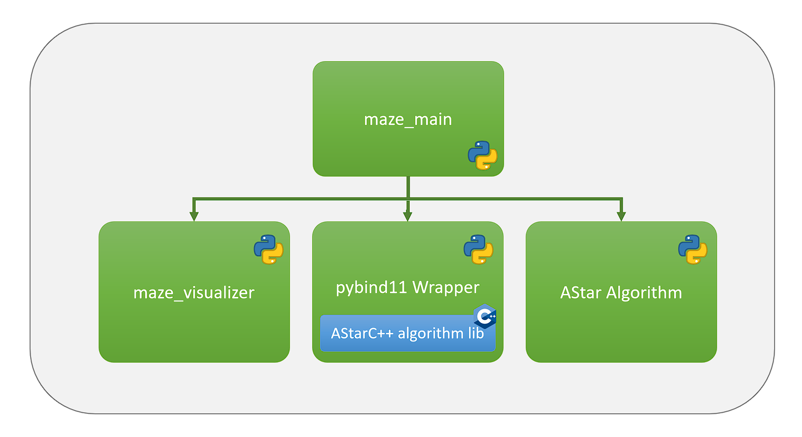

# Abhängigkeiten
Zum Bauen des ReferenceSolutionAStarCPP Projekts ist es notwendig das MazeRunner Repository mit weiteren repositories zu clonen.
```git clone --recursive https://github.com/AntoniaSophia/MazeRunner.git```

Wurde MazeRunner bereits normal gecloned, kann mit: ```git submodule update --init --recursive``` die notwendigen pybind11 und a-star repositories nachträglich gecloned werden

# Installation des VS2019 C++11 Compilers
Auszug aus https://docs.microsoft.com/de-de/cpp/build/building-on-the-command-line?view=msvc-160#download-and-install-the-tools

## Herunterladen und Installieren der Tools
Wenn Sie Visual Studio und einen C++-Workload installiert haben, verfügen Sie über alle Befehlszeilentools. Informationen zum Installieren von C++ und Visual Studio finden Sie unter Installieren der C++-Unterstützung in Visual Studio. Wenn Sie nur die Befehlszeilentools wünschen, laden Sie die Visual Studio Build Tools herunter. Wenn Sie die heruntergeladene ausführbare Datei ausführen, wird der Visual Studio-Installer aktualisiert und ausgeführt. Um nur die Tools zu installieren, die Sie für die C++-Entwicklung benötigen, wählen Sie die Workload C++-Buildtools aus. Sie können optionale Bibliotheken und Toolsets auswählen, die unter Installationsdetails enthalten sein sollen. Wählen Sie zum Erstellen von Code mithilfe der Visual Studio 2015- oder 2017-Toolsets die optionalen Buildtools von MSVC v140 oder v141 aus. Wenn Sie die gewünschten Einstellungen vorgenommen haben, wählen Sie Installieren aus.


# Grundlagen


## pybind11
pybind11 ist eine leichtgewichtige, reine Header-Bibliothek, die C++-Typen in Python und umgekehrt offenlegt, hauptsächlich um Python-Bindungen von vorhandenem C++-Code zu erstellen. 

https://pybind11.readthedocs.io/en/stable/
https://github.com/pybind/cmake_example
https://figshare.com/articles/presentation/pybind11_basics/6247561/1

## Reference ASTar in C++
https://github.com/daancode/a-star.git

# Bauen
Öffne **x86_x64 Cross Tools Command Prompt for VS 2019**
```
cd MazeRunner\Teams\ReferenceSolutionAStarCPP
mkdir build
cd build
cmake -G "NMake Makefiles" ..
nmake
```